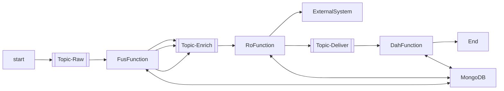

```bash
kafka-console-producer.sh --producer.config /opt/bitnami/kafka/config/producer.properties --bootstrap-server kafka:9092 --topic cloud-stream

kafka-console-consumer.sh --consumer.config /opt/bitnami/kafka/config/consumer.properties --bootstrap-server kafka:9092 --topic cloud-stream --from-beginning
```